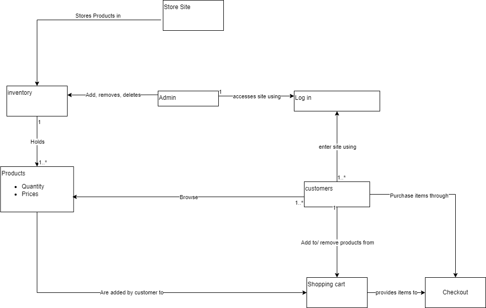
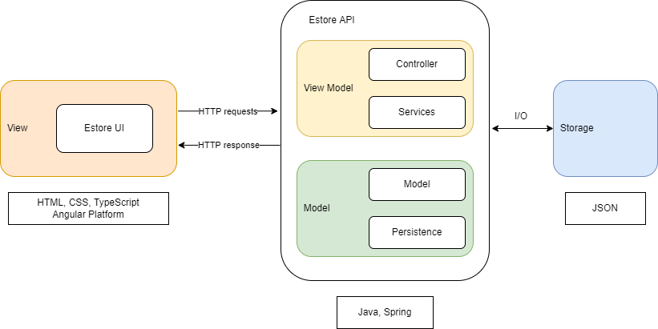
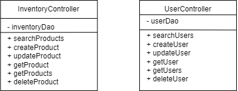
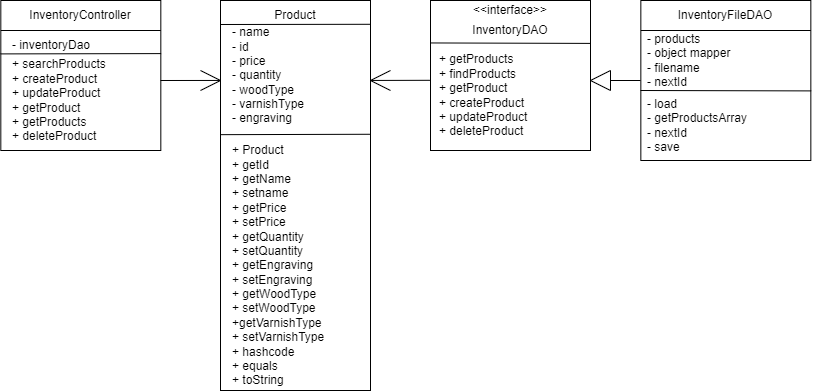
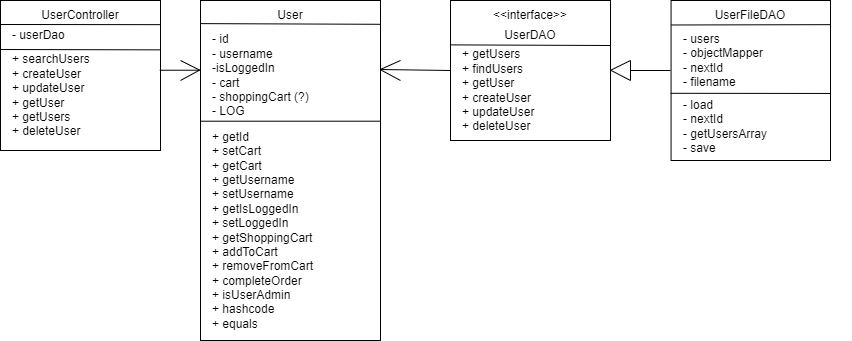
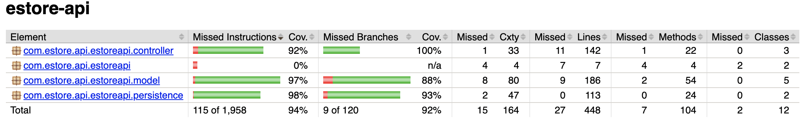
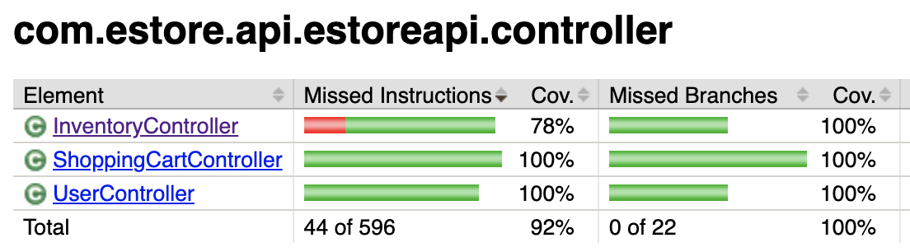
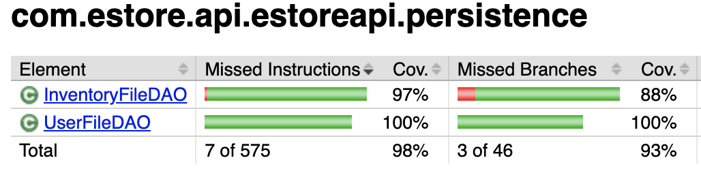
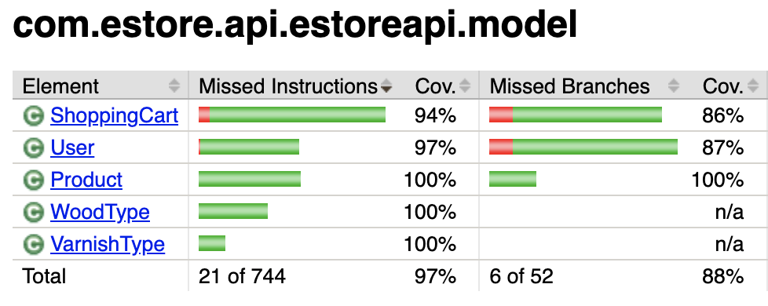

# PROJECT Design Documentation

## Team Information
* Team name: Error 451  (Team 2b)
* Team members
  * Miguel Reyes
  * Teagan Nester
  * Caitlyn Cyrek
  * Ainsley Ross
  * Trevor Borden

## Executive Summary

This is a summary of the project.
theWoodStore is an estore which is dedicated to making the acquisition of wood based artistry and cutlery more easily accessible. We want to provide a platform on which customers can, easily and safely, browse and purchase various wood products including bowls, plates, cups and more.

### Purpose
Our purpose is to allow our customers to purchase high quality wood products with a considerable amount of freedom towards customization. Regarding the store owner functionality, they can view, add, update, and delete products from their listing.

### Glossary and Acronyms

| Term | Definition |
|------|------------|
| SPA | Single Page |
| User | Any person who accesses our website |
| Buyer | A person who logs in with the intention to purchase goods |
| Admin | A person who logs in with the admin username and upkeeps the estore |
| Shopping cart | A collection of products chosen by a user for them to purchase at the checkout |
| Product | The goods which are sold in the store |
| MVP | Minimum Viable Product |
| 10% feature | An additional feature implemented on top of the MVP |
| DAO | Data Access Object, within the persistence tier |
| HTTP | HyperText Transfer Protocol, a network protocol for specifications on how data should be transferred |
| CSS | Cascading Style Spreadsheets that describe how HTML elements are to be displayed on screen |
| UI | View section of the project to be shown to the user |
| API | Application Programming Interface, connection interface between computers or computer programs |

## Requirements

This section describes the features of the application.

theWoodStore supports user creation via signup and will display an error message to the user if the username provided is not already a logged user.
theWoodStore supports userLogin via username, with “admin” reserved for the store owner, to control traffic into two main pages: the customer browse page and the admin browse page. 

User Features:
Users can see the list of products in the inventory. This inventory can be filtered by max price where the list of products shown will update on the user’s screen to only display products beneath the user-defined max price. The inventory shown can also be updated live via a product search. Only products containing the user-defined search term will be shown on the screen. The user can click on any product shown to be redirected to each product’s detail page. From there the user can change the woodType, varnishType, and add an optional engraving, before adding the product to their shopping cart. The user can continue to shop, add to their shopping cart, and remove from the shopping cart. From the shopping cart, the user can see the list of products they have in their shopping cart and can click on the checkout button to finalize their purchase. At all times, the user can navigate from Login, Browse, and ShoppingCart pages. 
Admin Features:
The admin can see the list of products in the inventory, search for specific products, and add new product listings on their browse page. When the admin clicks on a specific product listing, they are directed to the product’s detail page where they can update the price and quantity.

### Definition of MVP

The minimum viable product includes: 
Login and logout functionality, where an administrator can log in as admin and no passwords are required
Customer functionality, including searching for products, adding products to their shopping cart, and checking out
Inventory management, which allows e-store owners to add, remove, and update products in the inventory
Data persistence, so that the inventory, users, and user shopping carts are saved
10% feature - An additional feature implemented on top of the MVP.

### MVP Features

Our top level epics include the login process, assigning different roles to different logins and the shopping cart process, adding to a customer’s shopping cart and changing the inventory respectively.

Users can login via the login page which will redirect depending on if the user is a customer or an admin.
Customers and admin can search for products via product name on the browse page.
Customers can add products to their own shopping cart on each of the products’ product-detail page.
Customers can checkout and finalize their purchase via the shopping cart page. 
Admin’s can add, remove and update products through each product-detail page.
Customers are able to add products to their shopping cart and keep those products within their respective cart even after logging out and then in again. The product data is consistent between all users, so if a user were to add a product to their shopping cart, that product/quantity will be updated to reflect the temporary loss in inventory. This way no two customers can have the same product in their cart at the same time, limiting room for error and practicing data persistence. All new users are kept within the JSON file which can be updated via the UI new user creation.

10% feature -  Customers can filter the list of products shown based on a customizable $0 to max price range. Customers can also customize the product within the product-detail page to determine woodType, varnishType, and add an optional engraving.

During our planning we broke the MVP into these SCRUM processes–

Epic: Maintain Inventory
Stories: Update a product, Create a new product, Delete a single product

Epic: Customer functionality
Stories: Browse products, Filter Products, Customize order, Search for a product

Epic: Checkout
Stories: Add a product to shopping cart, Remove a product from shopping cart, Order confirmation, Checkout quantity max, Shopping cart creation

Epic: Login
Stories: Error message on login/signup failure

Other stories: Beautify, Get a single user, Update a user, Search for a user, Delete a user, Create new user, Get a single product, Get entire inventory

### Roadmap of Enhancements

*Price filter- The user can type in a number in the price filter to set the max price for products being displayed.
*Product customization- For each product, the user has a choice between thirteen different wood types and four different varnish types. They may also choose to add an engraving to their piece, but it is not required.

## Application Domain

This section describes the application domain.

Our project’s main domain entity is our users. Users are two main groups, the customers and the admins. Customers use the website to browse our selection of wood products and add those products to their shopping carts where they can eventually check out and purchase those products.  Admins are the people who maintain the website. They have the ability to update product information (quantity and price), add new product listings, and delete product listings. 

## Architecture and Design

This section describes the application architecture.

Our application consists of three major components, the view, the estore API, and the storage. The estore UI is housed within the view component, is composed of HTML, CSS, and TypeScript, and is built using the Angular platform. The view sends HTTP requests to the estoreAPI, which in turn sends HTTP responses. The estore API component contains the view model and the model. The controller and services are contained within the view model, both of which are written in Java, and the controller also uses Spring framework. Within the model, we have our persistence and our application model, which are both written in Java. The estore API communicates with the storage via I/O. The storage is composed of JSON files.

### Summary

The following Tiers/Layers model shows a high-level view of the webapp's architecture.

The e-store web application, is built using the Model–View–ViewModel (MVVM) architecture pattern. 

The Model stores the application data objects including any functionality to provide persistance. 

The View is the client-side SPA built with Angular utilizing HTML, CSS and TypeScript. The ViewModel provides RESTful APIs to the client (View) as well as any logic required to manipulate the data objects from the Model.

Both the ViewModel and Model are built using Java and Spring Framework. Details of the components within these tiers are supplied below.

### Overview of User Interface

This section describes the web interface flow; this is how the user views and interacts
with the e-store application.

When a user first launches the application, they see the login page, where they are given the option to either login or to sign up. From the sign up option, the user is taken to a page which prompts for a username. The user can then either select to create their account, or to cancel. Cancel takes the user back to the login page. Create account will create a new account for the user with the given username, log them in, and bring them to the browse page unless there is already an account with that username, in which case, the user will receive a message alerting them of this issue. 
Now, when the user is on the login page, enters an existing username that is not “admin,” and selects the login option, they are logged into the application and are taken to the browse page, where they see the inventory of products below a menu bar, with the options of login, browse, and shopping cart, along with a search bar where they can search for products whose names contain the entered string. If they select a product from this browse page, they are taken to a page containing details of the product, which also gives them the option to add the item to their cart, and to personalize the item (i.e. add an engraving message, choose their varnish). If they select the shopping cart option from the menu, they are taken to a page which displays the items currently in their shopping cart. 
When the user is on the login page and enters the username “admin,” they are brought to the admin-browse page where they can view and add products to, or remove products from, the inventory. When they select a specific product, they are brought to the admin-product-detail page, where they can update the product’s information.

### View Tier

We manage our view using components that can be routed back and forth in order to support admin and customer functionality. We support a customer browse page with a detail-product page and shopping cart. We also support an admin browse page with a detail-product page capable of updating product information. On all views/routed pages the user/admin can traverse between login/logout, browse, and shopping cart (customer specific)

The user begins at the login page where they can either login if they have an account or be rerouted to the signup page. After logging in, the customer is brought to the browser/home-page. From there they can either logout and be brought back to the signin page, go to their shopping cart, or go to a detailed view of a selected product. The admin had the possible movement minus the ability to view a shopping cart.  

We currently include 10 components to support our View Tier. We use admin-page and home-page to show our products. We use the login-page and sign-up page to process users. And we use the shopping cart page to show our customers their shopping cart. All other components are supporting items to help display products, product details, and other customization or search options.

Home-page is responsible for showing products with price to the user depending on the inventory.
Admin-page is responsible for showing products with product ID, price, and quantity to the admin depending on inventory.
Login-page is responsible for processing users vs admin and redirecting to their respective browse pages
Shopping-Cart-page is responsible for displaying the products a customer has in their shopping cart and supporting removal from cart along with order confirmation.
Product-detail is responsible for displaying the details of each product and add to cart functionality
Admin-Product-Detail is responsible for displaying the product details to the admin and also supports front end update product capabilities
Product-Search is responsible for showing to both the admin and the customer the list of products that include any segment of provided text

### ViewModel Tier

In our ViewModel Tier we have structures for the controller and services that communicate with each other in order to perform application-specific logic and manipulate data between the user interface and our backend data. 

This relationship is responsible for maintaining the data persistence of details such as our User and Product lists. Our ViewModel Tier helps connect the front end view for possible users and products with the stored values within our api and facilitates communication between the two. This tier is responsible for updating changes in the inventory given any direction of the admin/customer, like when an admin deletes a product or when a customer finishes checking out with certain products that will need to be deleted from the inventory availability.
Our services layer is responsible for retrieving the models outlined by the controller in order for us to access data objects, like the current User (which we can use to keep track of our current shopping cart to be displayed). This layer is also responsible for communicating any updates to values made in the front end/components. 

Our controller includes components such as InventoryController and UserController. The InventoryController is responsible for manipulating the products in our inventory, like searching for products, creating a product, or updating products. The UserController handles the manipulation of users, such as creating a user, searching for a user, and deleting a user. The methods of these controller files clearly explain how they are used and the UML for each is shown below.

### Model Tier

In our model tier, we have the persistence and the model for our application. Because the inventory must be persistent, it consists of a Product.java file in the model, with corresponding InventoryFileDAO.java and InventoryDAO.java files in the persistence component. The user also contains a shopping cart that is persistent, so the user files follow the same setup as inventory.
	The User.java file in the model consists of basic setters and getters for the different attributes of a User, along with a method to determine whether the user is admin, a hash function, and an equals function. The corresponding files in the persistence component include the UserDAO.java file, which makes calls to the UserFileDAO.java file. Both these files feature the methods needed to create a user and add/change their info in the User JSON file, allowing the users to be persistent. One of the user’s attributes, their shopping cart, will contain Product types, and there is a class called Product.java in the model component. This class contains basic setter and getter methods, along with a hash function, a toString function, and an equals function. There are also supporting enum files named WoodType.java, which specifies a list of different woods that the Product can be made of, and VarnishType.java, which specifies the different types of varnish that can be used on a bowl. All products are stored in the Inventory, which is the Product’s corresponding persistence file(s). The inventory is composed of two files within the persistence component, InventoryDAO.java and InventoryFileDAO.java. These files both contain methods to create, get, get all, find, update, and delete products, with the InventoryDAO making calls to the InventoryFileDAO which updates the inventory JSON file, allowing the inventory to be persistent. 

### Static Code Analysis/Design Improvements
Regarding the backend of the estore, the majority of issues are with unit tests having no assertions, having the expected and actual values swapped, and comparing values against themselves. Fixing these would significantly decrease the number of code smells and improve the overall design, since unit tests allow us to make other changes more easily.

(Static Testing 1)[StaticTesting.png]

In the UI, there were 4 bugs in total. Much like the API issues, these bugs were not functionality compromising. They were mostly issues with the html and css setup that can be quickly fixed.

(Static Testing 2)[StaticTesting2.png]

Also, a key function for managing the user’s shopping cart has a high Cognitive Complexity, meaning that the code is difficult to follow. Breaking this function up with more, well-commented helper methods will make it easier to understand and maintain.

(Static Testing 3)[StaticTesting3.png]

An issue that is not represented in the metric data is the lack of responsive web design. There have been issues correctly displaying the navigation bar on different screens, which is likely because the css defines its size absolutely. A responsive design would also improve usability for both the admin and the customer because they would be able to easily view the site from different machines. Other features to improve usability would be to implement a messaging system for users to communicate with the store owner, allow customers to review products, and Allow customers to receive a notification when a selected item comes back in stock.

## Testing

_Our testing strategies involved acceptance testing, unit testing and using a code coverage tool > to inspect just how many lines of code are being covered by the unit tests._

### Acceptance Testing

23/23 user stories passed all their  acceptance criteria tests. 50/50 acceptance criteria tests. Although all user stories passed all of their acceptance criteria tests, there were some cases that were not considered during testing. These cases include: updating or removing a product in the user’s cart if the admin updates or removes the product, only allowing the user to checkout if they have at least one product in their cart, and redirecting the admin to the admin product detail page when they select a product from the filtered list.

### Unit Testing and Code Coverage

Our unit testing strategy is to make sure that our tests are thorough, independent and readable. Thorough meaning that we are performing at a high code coverage - at least 90% overall. Independent meaning that we are testing one thing at a time. For example, we’ve decided that a unit is a class. We are testing each and every component of a class - its state and functions as well as those functions method arguments. 

Every class in the controller has 100% coverage, but the InventoryController which is currently at 78%. This is due to the fact that we did not test searchProducts() because at the time we thought it would be more important to focus on implementing tests for our other classes like the classes in the persistence tier and our ShoppingCartController. We were confident in our decision because we had used the function many times without any problems.

Throughout the entirety of the development stages (sprints 2-3) our approach to unit testing was trial and error - running jacoco and using its feedback as a way to build more and or stronger tests. We repeated this step until we satisfied a minimum of 90% overall code coverage

Our model is well covered as the tests were not so complicated with the exception of the ShoppingCart and User class. These are not at 100%, but that is because of the many branches that needed to be covered in some of our functions like addToCart() and removeFromCart(). We were overall satisfied with our code coverage especially because we did many hands-on test-runs checking for all kinds of user input/behavior. 

## Object-Oriented Principle Adherence

### Information expert
Information expert can be described as giving responsibilities pertaining to certain information to the classes that contain the information needed. This can result in a need for more methods in some classes, but can make it easier, simpler, and safer to access data and fulfill responsibilities. An example of this in our design can be seen in the InventoryFileDAO class. This class has access to the file name containing information about existing products. So, in order to make data access more efficient, this class also has the methods necessary to access and make changes to the data (Please see UML class diagram below). The following methods are implemented in the InventoryFileDAO file itself, whereas they are simply called (or stubbed, in the case of this class’ interface) in other files which don’t have access to the file name like this class does.

[Inventory File DAO Class Diagram](InventoryFileDAOClassDiagram.png)

### Controller
The controller can be described as the first layer of the program the data sees after being gathered through the UI and before it goes to the application. A good controller should not do much work itself, it instead passes on the data to a class that can handle it. In our project, we have a class called InventoryController which serves as our controller. This class takes in data from the UI, calls the correct function from the model tier to handle the data, and returns an HTTP status reflecting the state of the data and program. All of our user events are handled through this class. A specific example in our code is the getProducts method in the InventoryController class (class diagram pictured below). This method accepts an integer id, then calls the function getProduct from the InventoryFileDAO class, which is part of the application/model. The controller class does not do anything more with the data other than hand it over to the appropriate class and send an HTTP status back out to the UI.

[Inventory Controller Class Diagram](InventoryControllerClassDiagram.png)
[getProduct Method](getProductMethod.png)

### Single Responsibility
The inventory, the management of API responses and product data is split up. The InventoryDAO files deal with the manipulations, saving, and storing of the products data, while InventoryController is in charge of giving HTTP responses to API requests. The same goes for our representation of, storage, and management of site users.

### Dependency Injection
Dependency Injection is defined to be a principle that provides looser coupling between dependent entities. In other words, higher level classes should not depend on low-level classes. Both should depend on some layer of abstraction to communicate. Our estore-api is built on Spring boot which provides what is necessary for successfully implementing dependency injection through the use of a configuration file. Dependency injection is implemented between our InventoryController, and InventoryFileDAO through the interface InventoryDAO. Spring, via configuration, creates an InventoryFileDAO object. It then injects this object into the InventoryController when it is instantiated. The InventoryController only deals with higher level InventoryDAO (the abstraction layer). The benefit of this is that the lower level implementation of storing and accessing/manipulating data can be updated at any point in time without having an effect on the InventoryController class’s responsibility. To illustrate this, our current underlying storing mechanism is a file using json objects representing an array of products. But this could be switched out for another persistent storage mechanism, like a database such as PostgreSQL. And when this happens dependency injection comes into play by injecting this new system, via the configuration file, into the InventoryController class. The InventoryController still functions as if a change was never made because of that layer of abstraction in our InventoryDAO interface. In conclusion, our architecture follows this pattern everywhere necessary in the project. At this very moment it does not need improvement in regards to adhering to the dependency injection OO design.